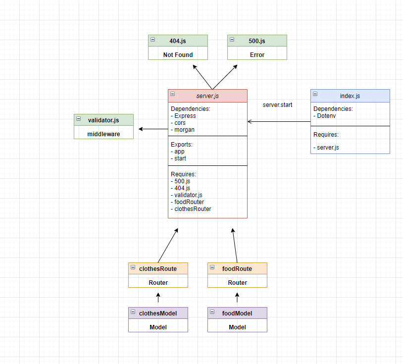

# basic-api-server

## Description

Phase 2 Requirements
Build a REST API using Express, by creating a proper series of endpoints that perform CRUD operations on a database, using the REST standard

Data Models
Create 2 in-memory data models using ES6 Classes, exported as Node Modules
Define your field names and an empty data storage in the constructor
The classes should have the following methods defined, to perform CRUD Operations:
create()
Should ensure that the record created only has the fields that you defined
get() or read()
update()
delete()
For the data models, you are free to choose your own data types and describe their fields … For Example: person, animal, car, instrument, game

Routes
In your express server, create a route module for each data model that you’ve created. Within the router module, create REST route handlers for each of the REST Methods that properly calls the correct CRUD method from the matching data model.

For these examples, we’ll use ‘food`

Add a Record
CRUD Operation: Create
REST Method: POST
Path: /food
Input: JSON Object in the Request Body
Returns: The record that was added to the database.
You must generate an ID and attach it to the object
You should verify that only the fields you define get saved as a record
Get All Records
CRUD Operation: Read
REST Method: GET
Path: /food
Returns: An array of objects, each object being one entry from your database
Get One Record
CRUD Operation: Read
REST Method: GET
Path: /food/1
Returns: The object from the database, which has the id matching that which is in the path
Update A Record
CRUD Operation: Update
REST Method: PUT
Path: /food/1
Input: JSON Object in the Request Body
Returns: The object from the database, which has the id matching that which is in the path, with the updated/changed data
You should verify that only the fields you define get saved as a record
Delete A Record
CRUD Operation: Destroy
REST Method: DELETE
Path: /food/1
Returns: The record from the database as it exists after you delete it (i.e. null)
Implementation Notes
Create an express server with the following proposed structure
├── .gitignore
├── .eslintrc.json
├── __tests__
│   ├── server.test.js
│   ├── logger.test.js
├── src
│   ├── error-handlers
│   │   ├── 404.js
│   │   ├── 500.js
│   ├── middleware
│   │   ├── logger.js
│   │   ├── validator.js
│   ├── models
│   │   ├── food.js
│   │   ├── clothes.js
│   ├── routes
│   │   ├── food.js
│   │   ├── clothes.js
│   ├── server.js
├── index.js
└── package.json
In your server.js, require() your router modules, and use() them
In your routers, require() the correct data model and instantiate a new instance
Testing Requirements
Assert the following
404 on a bad route
404 on a bad method
The correct status codes and returned data for each REST route
Create a record using POST
Read a list of records using GET
Read a record using GET
Update a record using PUT
Destroy a record using DELETE
Deployment
Your server must be deployed to Heroku. Please note the deployed URL in your README!

---------------------------------------------------------------------------------------

## Links

Heroku Link:  https://basic-api-server-yazan.herokuapp.com/

Github Actions: https://github.com/yazantafesh/basic-api-server/actions

Pull Request: https://github.com/yazantafesh/basic-api-server/pull/1

## UML

